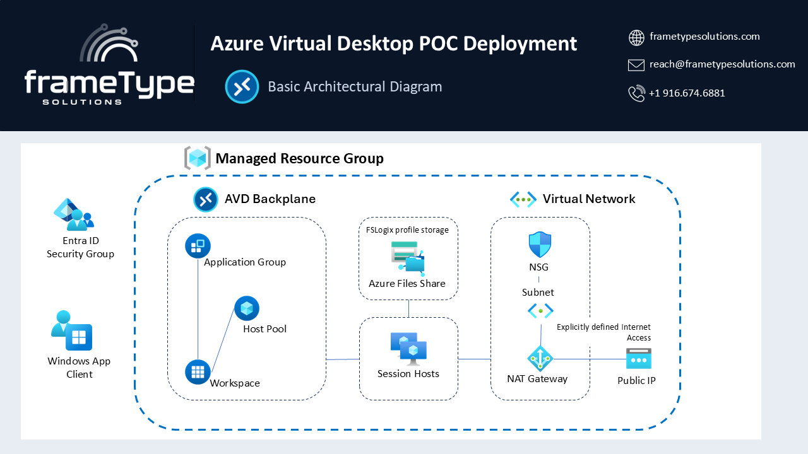

---

🚀 [Azure Marketplace Offer](https://azuremarketplace.microsoft.com/en-us/marketplace/apps?search=frametype&page=1)

---

## Azure Virtual Desktop — Cloud-Native Deployment

### Purpose

This offer deploys a fully configured, cloud-native Azure Virtual Desktop (AVD) environment directly from the Azure Marketplace. It is designed for organizations that want to deliver secure, scalable virtual desktops to their users without the complexity of on-premises Active Directory or hybrid identity infrastructure.

Key outcomes this offer delivers:

1. **Cloud-Only Identity:** Session hosts are joined directly to Microsoft Entra ID — no domain controllers, no Azure AD Domain Services, and no hybrid AD infrastructure required.

2. **Persistent User Profiles:** FSLogix profile containers are stored on Azure Files using Entra Kerberos authentication, providing fast, reliable profile roaming across sessions and session hosts.

3. **Zero Trust by Design:** Session hosts have no public IP addresses, all authentication uses modern Entra ID tokens, RBAC assignments follow least privilege, and full diagnostic logging is enabled. See the [Zero Trust Alignment](#zero-trust-alignment) section for a complete mapping to Microsoft's Zero Trust principles.

4. **Automated Scaling:** An AVD Scaling Plan automatically starts and deallocates session hosts based on user demand, minimizing compute costs during off-peak hours.

5. **Built-in Monitoring:** Azure Monitor Agent and Log Analytics provide AVD Insights, connection diagnostics, and session host health monitoring out of the box.

6. **Security by Default:** RBAC assignments, Conditional Access MFA exclusions, and Entra ID group-based access control are configured as part of the deployment.

### Scope

This offer deploys a pooled AVD host pool with Windows 11 Enterprise Multi-Session session hosts, suitable for knowledge workers sharing virtual desktops. It is a Proof of Concept configuration designed to be extended to production scale. It does not include hybrid domain join, custom images, or ExpressRoute/VPN connectivity.

---

## Overview

### Architecture Overview



The following Azure resources are deployed as a Marketplace managed application. All resources are provisioned into a managed resource group and governed by the offer.

### Components

| Resource | Type | Purpose |
|---|---|---|
| `mrg-avd-<env>-<region>-01` | Managed Resource Group | Container for all deployed resources |
| `hp-avd-<env>-<region>-01` | AVD Host Pool | Pooled host pool, DepthFirst load balancing |
| `ag-avd-<env>-<region>-01` | AVD Application Group | Desktop application group |
| `ws-avd-<env>-<region>-01` | AVD Workspace | User-facing workspace |
| `sp-avd-<env>-<region>-01` | AVD Scaling Plan | Weekday and weekend autoscale schedules |
| `saavd<env><region>01` | Storage Account | Azure Files share for FSLogix profiles |
| `vn-avd-<env>-<region>-01` | Virtual Network | Private VNet with 3 subnets |
| `ng-avd-<env>-<region>-01` | NAT Gateway | Deterministic outbound IP for session hosts |
| `pip-avd-<env>-<region>-01` | Public IP | Static IP associated with NAT Gateway |
| `vm-avd-<env>-<region>-<NN>` | Virtual Machines | Windows 11 Multi-Session session hosts |
| `law-avd-<env>-<region>-01` | Log Analytics Workspace | AVD Insights and session host monitoring |

### Networking

The Virtual Network is segmented into three subnets:

| Subnet | Purpose |
|---|---|
| `azAvdSubnet` | Session host NICs — associated with NAT Gateway |
| `AzProfileSubnet` | Reserved for profile and management workloads |
| `default` | General purpose / future expansion |

No inbound network paths are opened. Users connect to session hosts exclusively through the AVD reverse-connect transport (port 443 outbound from session hosts to the AVD gateway). No RDP port exposure is required.

### Session Hosts

| Property | Value |
|---|---|
| OS | Windows 11 Enterprise Multi-Session |
| VM Size | Standard_D4s_v5 (4 vCPU / 16 GB RAM) |
| Default Count | 2 |
| Identity | Entra ID joined (cloud-only) |
| Profile Storage | FSLogix on Azure Files via Entra Kerberos |

---

## Azure Pricing

The following resources contribute to the monthly cost of this deployment. All estimates are approximate and vary by region and usage.

- **Virtual Machines:** Standard_D4s_v5 at ~$140/month per VM when running continuously. The scaling plan deallocates idle hosts to minimize cost — actual spend depends on usage patterns.
- **Azure Files (Storage Account):** Transaction-optimized tier. Cost depends on profile data volume; typically minimal for a PoC workload.
- **NAT Gateway:** ~$32/month (Standard SKU) plus data processing charges.
- **Log Analytics Workspace:** Pay-per-GB ingestion. AVD diagnostics data volume is typically low.
- **Public IP Address:** ~$3.60/month (Standard SKU static).
- **Virtual Network:** No charge for the VNet itself.

For current pricing, refer to the [Azure Pricing Calculator](https://azure.microsoft.com/en-us/pricing/calculator/).

---

## Prerequisites

The following are required before deploying this offer from the Azure Marketplace.

| Requirement | Details |
|---|---|
| Azure Subscription | Contributor or Owner role on the target subscription |
| Entra ID Permissions — pre-deployment | Global Administrator, Groups Administrator, or User Administrator (to create security groups) |
| Entra ID Permissions — post-deployment | Global Administrator, or both Application Administrator and Conditional Access Administrator |
| PowerShell 7.0 or later | Required to run both the pre-deployment and post-deployment scripts |
| Azure CLI 2.50.0 or later | Required to run both the pre-deployment and post-deployment scripts |
| Outbound Internet Access | Required from the machine running both scripts |

> **Note:** The offer deployment itself runs entirely from the Azure Portal and has no local tooling requirements. PowerShell 7 and Azure CLI are only required for the pre-deployment and post-deployment scripts.

---

## Deployment Steps

Deploying this offer involves four steps in sequence. Steps 1 and 3 require running a signed PowerShell script. Step 2 is the Marketplace wizard itself.

```
Step 1 — Run pre-deployment script   →   Step 2 — Deploy from Marketplace   →   Step 3 — Run post-deployment script   →   Step 4 — Add users and connect
```

---

### Step 1 — Run the Pre-Deployment Script (REQUIRED BEFORE MARKETPLACE WIZARD)

The Marketplace deployment wizard requires the **Object IDs of two Entra ID security groups** on the Identity configuration step. These groups must exist in your tenant before you begin the wizard.

The pre-deployment script creates both groups (or retrieves them if they already exist) and outputs the Object IDs ready to paste into the wizard. It also writes an `avd-prerequisites.json` sidecar file to your current directory as an audit record.

Download and run the script from PowerShell 7:

```powershell
# Download the script
Invoke-WebRequest -Uri "https://raw.githubusercontent.com/frametypeSolutions/msMarketplaceOffer-azureVirtualDesktopPoc/main/preDeploymentScripts/avdPreDeployment.ps1" -OutFile ".\avdPreDeployment.ps1"

# Unblock the downloaded file
Unblock-File .\avdPreDeployment.ps1

# Run the script
.\avdPreDeployment.ps1
```

The script will prompt for:
- **Environment code** — a short label used in group names and resource names (e.g. `dev`, `prod`)
- **Azure region** — the region you intend to deploy to (e.g. `westus2`)

On completion, the script displays a summary box similar to:

```
╔══════════════════════════════════════════════════════════════════╗
║                  ✔  Prerequisites Complete                      ║
╠══════════════════════════════════════════════════════════════════╣
║  Paste these values into the AVD Marketplace deployment wizard  ║
╠══════════════════════════════════════════════════════════════════╣
║                                                                  ║
║  AVD Users Group Object ID                                       ║
║  xxxxxxxx-xxxx-xxxx-xxxx-xxxxxxxxxxxx                            ║
║                                                                  ║
║  AVD Admins Group Object ID                                      ║
║  xxxxxxxx-xxxx-xxxx-xxxx-xxxxxxxxxxxx                            ║
╚══════════════════════════════════════════════════════════════════╝
```

Copy both Object IDs — you will need them in the next step.

> **Permissions required:** The account running this script must hold one of **Global Administrator**, **Groups Administrator**, or **User Administrator** in Entra ID.

> **Idempotent:** If the groups already exist, the script retrieves and reuses them rather than creating duplicates. It is safe to run multiple times.

---

### Step 2 — Deploy from Azure Marketplace

1. Locate the offer in the [Azure Marketplace](https://azuremarketplace.microsoft.com/en-us/marketplace/apps?search=frametype&page=1)
2. Click **Get It Now** and follow the deployment wizard
3. Complete the five configuration steps:
   - **Basics** — Subscription, resource group, region, environment code
   - **Network** — VNet CIDR range
   - **Compute** — Session host count and VM size
   - **Identity** — Paste the two Entra ID group Object IDs from Step 1
   - **Review + Create** — Validate and deploy
4. Deployment typically completes in 20–30 minutes

---

### Step 3 — Run the Post-Deployment Script (REQUIRED AFTER MARKETPLACE WIZARD)

After the Marketplace deployment completes, run the post-deployment script to complete three steps that cannot be performed within the ARM deployment:

1. **Grant admin consent** for the Azure Files storage enterprise application — required for FSLogix Entra Kerberos authentication
2. **Exclude the storage application from MFA Conditional Access policies** — required for FSLogix to mount the profile share at session startup, before the user's MFA state is established
3. **Associate the AVD Scaling Plan with the Host Pool** — deferred from ARM deployment due to RBAC propagation timing

> **FSLogix will not function until Steps 1 and 2 of this script complete successfully.**

Download and run the script from PowerShell 7:

```powershell
# Download the script
Invoke-WebRequest -Uri "https://raw.githubusercontent.com/frametypeSolutions/msMarketplaceOffer-azureVirtualDesktopPoc/main/postDeploymentScripts/avdPostDeployment.ps1" -OutFile ".\avdPostDeployment.ps1"

# Unblock the downloaded file
Unblock-File .\avdPostDeployment.ps1

# Run the script
.\avdPostDeployment.ps1
```

The script auto-discovers all deployed resources based on the environment code and region you provided during deployment. It will prompt for confirmation before making any changes.

> **Permissions required:** The account running this script must hold **Global Administrator** or both **Application Administrator** and **Conditional Access Administrator** roles in Entra ID.

---

### Step 4 — Add Users and Connect

Add user accounts to the Entra ID security groups created by the pre-deployment script:

- **AVD Users group** — Standard users who will access virtual desktops
- **AVD Admins group** — Administrators who need elevated access to session hosts

Users must be assigned a valid Microsoft 365 or Windows license that includes AVD access rights.

Users can connect to their virtual desktop using:

- **Web browser:** [https://client.wvd.microsoft.com](https://client.wvd.microsoft.com)
- **Windows Desktop client:** [Download](https://learn.microsoft.com/en-us/azure/virtual-desktop/users/connect-windows)
- **macOS, iOS, Android clients:** Available from respective app stores

---

## Zero Trust Alignment

This offer is designed around Microsoft's Zero Trust security principles. Every architectural decision maps to one or more of the three core principles: **Verify Explicitly**, **Use Least Privilege**, and **Assume Breach**.

| Principle | Implementation |
|---|---|
| **Verify Explicitly** | Session hosts are Entra ID joined — all authentication uses modern tokens, not NTLM or Kerberos from on-premises AD. FSLogix profile access uses Entra Kerberos tickets issued by Entra ID directly. MFA Conditional Access policies remain in effect for all user access — only the Azure Files storage application is excluded, and only because FSLogix must mount the profile share before the user's MFA state is established at session startup. |
| **Use Least Privilege** | RBAC assignments are scoped to the minimum required level. Users receive `Desktop Virtualization User` and `Virtual Machine User Login` only. Session host managed identities receive `Storage File Data SMB Share Contributor` on the storage account only — not at subscription or resource group scope. The AVD service principal receives `Desktop Virtualization Power On Off Contributor` for scaling only. No standing Owner or Contributor assignments are made to user accounts by the offer. |
| **Assume Breach** | Session hosts have no public IP addresses — there are no inbound network paths to exploit. All user connectivity uses the AVD reverse-connect transport (port 443 outbound only). Outbound traffic routes through a NAT Gateway with a static public IP, enabling downstream firewall allowlisting. Azure Monitor Agent and Log Analytics capture connection events, session host health, and FSLogix operational events for detection and response. |

### Zero Trust and Networking

The networking architecture enforces Zero Trust at the transport layer:

- **No RDP exposure** — port 3389 is never opened. The AVD reverse-connect gateway brokers all sessions over HTTPS.
- **Private session host NICs** — no public IP is assigned to any VM network interface.
- **Deterministic egress** — the NAT Gateway provides a single, static outbound IP that can be allowlisted in downstream firewalls or NSGs.
- **Subnet segmentation** — the AVD session host subnet (`azAvdSubnet`), profile subnet (`AzProfileSubnet`), and general subnet (`default`) are isolated within the VNet, supporting future NSG-based east-west traffic control.

### Zero Trust and Identity

- **No hybrid dependency** — there is no requirement for on-premises AD, AADDS, or VPN/ExpressRoute connectivity. The attack surface of legacy identity infrastructure is eliminated entirely.
- **Cloud-only device trust** — session hosts register as Entra ID devices. Device compliance policies and Conditional Access device filters can be applied without hybrid join.
- **Group-based access control** — all AVD access is governed through Entra ID security groups. Adding or removing a user from a group immediately grants or revokes desktop access without touching RBAC assignments.

For Microsoft's full Zero Trust guidance for AVD, refer to: [Zero Trust guidance for Azure Virtual Desktop](https://learn.microsoft.com/en-us/security/zero-trust/azure-infrastructure-avd)

---


- **No public IP on session hosts:** All inbound connectivity uses AVD reverse-connect. No RDP ports are exposed.
- **Entra ID joined:** No legacy domain join or NTLM authentication. All authentication uses modern Entra ID tokens.
- **FSLogix Entra Kerberos:** Profile share access uses Kerberos tickets issued by Entra ID — no on-premises KDC required.
- **RBAC least privilege:** Role assignments follow least-privilege principles. Users receive only the permissions required to connect and use their desktop.
- **Conditional Access:** The post-deployment script automatically excludes the Azure Files storage application from MFA CA policies. All other access remains subject to your tenant's CA policies.
- **Managed Resource Group:** All deployed resources are locked within the managed resource group and governed by the Marketplace offer.

---

## Azure Governance

This offer follows Cloud Adoption Framework (CAF) naming conventions and tagging best practices. All resources are tagged with the environment code and deployment metadata provided during the Marketplace wizard.

RBAC role assignments are scoped to the minimum required level — no subscription-wide Owner assignments are made by the offer itself.

For more information on Azure governance best practices, refer to the [Azure Well-Architected Framework](https://learn.microsoft.com/en-us/azure/well-architected/).

---

## Naming Conventions

All resources follow the [CAF recommended abbreviations](https://learn.microsoft.com/en-us/azure/cloud-adoption-framework/ready/azure-best-practices/resource-abbreviations) and the naming pattern:

```
{type}-avd-{environment}-{region}-{suffix}
```

For example: `hp-avd-prod-westus2-01`, `law-avd-prod-westus2-01`

Storage accounts follow a condensed alphanumeric format due to Azure storage naming constraints: `saavd{environment}{region}01`

---

## Identity and RBAC

This offer uses Microsoft Entra ID exclusively for identity. No on-premises Active Directory or Azure AD Domain Services is required.

| Principal | Scope | Role |
|---|---|---|
| AVD Users group | Application Group | Desktop Virtualization User |
| AVD Users group | Resource Group | Virtual Machine User Login |
| AVD Admins group | Application Group | Desktop Virtualization User + Contributor |
| AVD Admins group | Resource Group | Virtual Machine Administrator Login |
| AVD service principal | Resource Group | Desktop Virtualization Power On Off Contributor |
| Session host managed identities | Storage Account | Storage File Data SMB Share Contributor |
| AVD user/admin groups | Storage Account | Storage File Data SMB Share Contributor |

For RBAC best practices, refer to [Azure RBAC Best Practices](https://learn.microsoft.com/en-us/azure/role-based-access-control/best-practices).

---

## Scaling Plan

The AVD Scaling Plan is configured with Pacific Standard Time schedules optimized for a standard business day:

| Phase | Time | Behavior |
|---|---|---|
| Ramp Up | 7:00 AM | Start hosts, consolidate sessions (DepthFirst) |
| Peak | 9:00 AM | Full capacity, DepthFirst load balancing |
| Ramp Down | 5:00 PM | Consolidate sessions, deallocate empty hosts |
| Off Peak | 7:00 PM | Minimum footprint overnight |

The scaling plan is associated with the host pool by the post-deployment script. Hosts are deallocated (not deleted) during off-peak hours, preserving VM state while eliminating compute charges.

---

## Troubleshooting

### Pre-Deployment Script: Insufficient Role

**Symptom:** Script exits with `The signed-in account does not hold a required Entra ID role.`

**Resolution:** The account running the pre-deployment script must hold one of **Global Administrator**, **Groups Administrator**, or **User Administrator** in Entra ID. Ask your tenant administrator to assign one of these roles, then re-run the script. The script is idempotent — if groups were partially created, it will find and reuse them.

### Marketplace Wizard: Object ID Fields

**Symptom:** Unsure which Object IDs to paste into the Identity step of the wizard.

**Resolution:** Run the pre-deployment script — it outputs the exact values to paste and also writes them to `avd-prerequisites.json` in the current directory for reference. The two fields in the wizard correspond to the **AVD Users Group Object ID** and **AVD Admins Group Object ID** shown in the script's completion summary.

---

### FSLogix Profile Does Not Mount

**Symptom:** User receives a temporary profile on sign-in.

**Resolution:**
1. Verify the post-deployment script completed successfully — specifically Step 1 (admin consent) and Step 2 (CA exclusion).
2. Check that the user account is a member of the AVD Users Entra security group.
3. If admin consent was not granted, re-run the post-deployment script. It is safe to run multiple times.
4. For Microsoft-managed CA policies that could not be automatically excluded, follow the manual exclusion instructions output by the script.

### Session Host Shows as Unavailable

**Symptom:** Host pool shows session hosts with status other than Available.

**Resolution:**
1. Verify all four VM extensions show `Provisioning State: Succeeded` in the Azure Portal.
2. Check that the `AADLoginForWindows` extension succeeded — this is required before the DSC host pool registration extension can run.
3. If a session host was previously registered and the Entra device object is stale, delete the device object from Entra ID → Devices, then remove and re-add the `AADLoginForWindows` extension.

### Scaling Plan Not Associated

**Symptom:** Scaling Plan shows no host pool assignments.

**Resolution:** Re-run the post-deployment script. Step 3 will detect the missing association and prompt to create it.

### Post-Deployment Script: Script Cannot Be Loaded

**Symptom:** `The file is not digitally signed` error when running the script.

**Resolution:** The script is Authenticode signed by frameType Solutions but was downloaded from the internet. Unblock it before running:

```powershell
Unblock-File .\avdPostDeployment.ps1
```

---

## Conclusion

This offer provides a production-grade starting point for organizations evaluating or adopting Azure Virtual Desktop with a cloud-only identity model. The deployment is repeatable, follows Microsoft framework guidance, and is designed to be extended to production scale with additional session hosts, custom images, and enterprise networking as requirements grow.

For questions or support, contact [frameType Solutions](https://azuremarketplace.microsoft.com/en-us/marketplace/apps?search=frametype&page=1).

---

## References

| Resource | URL |
|---|---|
| AVD Documentation | https://learn.microsoft.com/en-us/azure/virtual-desktop/ |
| AVD Windows Client | https://learn.microsoft.com/en-us/azure/virtual-desktop/users/connect-windows |
| FSLogix + Entra Kerberos | https://learn.microsoft.com/en-us/azure/virtual-desktop/fslogix-profile-container-configure-azure-files-active-directory |
| CAF Naming Conventions | https://learn.microsoft.com/en-us/azure/cloud-adoption-framework/ready/azure-best-practices/resource-naming |
| Well-Architected Framework | https://learn.microsoft.com/en-us/azure/well-architected/ |
| Zero Trust Guidance for AVD | https://learn.microsoft.com/en-us/security/zero-trust/azure-infrastructure-avd |
| RBAC Best Practices | https://learn.microsoft.com/en-us/azure/role-based-access-control/best-practices |
| AVD Insights | https://learn.microsoft.com/en-us/azure/virtual-desktop/azure-monitor |
| Azure Pricing Calculator | https://azure.microsoft.com/en-us/pricing/calculator/ |
| Azure Marketplace (frametype) | https://azuremarketplace.microsoft.com/en-us/marketplace/apps?search=frametype&page=1 |

---

*Version 1.1.02 | frameType Solutions | April 2026*
